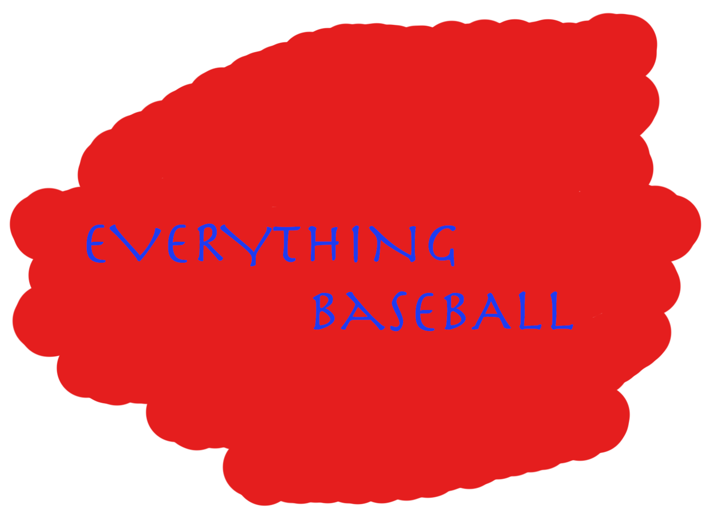
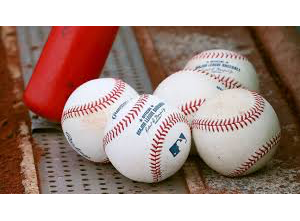

<!doctype html>
<html>
<head>
<meta charset="UTF-8">
<title>How to Create a Site</title>
<link href="../Documents/Site Folder/styles.css" rel="stylesheet" type="text/css">
</head>

<body>
	
	
	
<header>
	
	<nav id="nav">
	
	<ul>
		
<li><a href="https://www.google.com/search?q=mlb+stanings+2019&oq=mlb+stanings+2019&aqs=chrome..69i57.3637j0j7&sourceid=chrome&ie=UTF-8" target="_blank">Standings</a></li> 
		
<li><a href="https://www.youtube.com/watch?v=Q5yuxDOhnhM" target="_blank">Post-Season</a></li> 
		
<li><a href="https://www.youtube.com/watch?v=yIat0hViyYc" target="_blank">Defensive-Highlights</a></li> 

<li><a href="https://www.youtube.com/watch?v=RwHAjTgCKxE" target="_blank">Offensive-Highlights</a></li> 
		
<li><a href="https://www.youtube.com/watch?v=zgrfQ2b5MdM" target="_blank">Pitching-Highlights</a></li>
		
	</ul>
	
	</nav>
	
	<h2>Welcome to Everything Baseball!</h2>
	
	
</header>
	
	
<main>
	<section>

Everything Baseball is a constantly updating mlb information page. We include seasonal standings and highights from every season. When the 2020 mlb season takes place we will constantly be updating things, but for now enjoy all of our content from the 2019 season.

		</section>

	
	
	
	</main>	
<footer> 
Note:

	All suggestions are welcome. If you have any suggestions for the page please email me at chance.baganz@gmail.com
</footer>
   

</body>
</html>
